3. 关系数据库标准语言 SQL
3.2 王者荣耀数据库

### MySQL 中的数据库
- 系统数据库
- 用户数据库

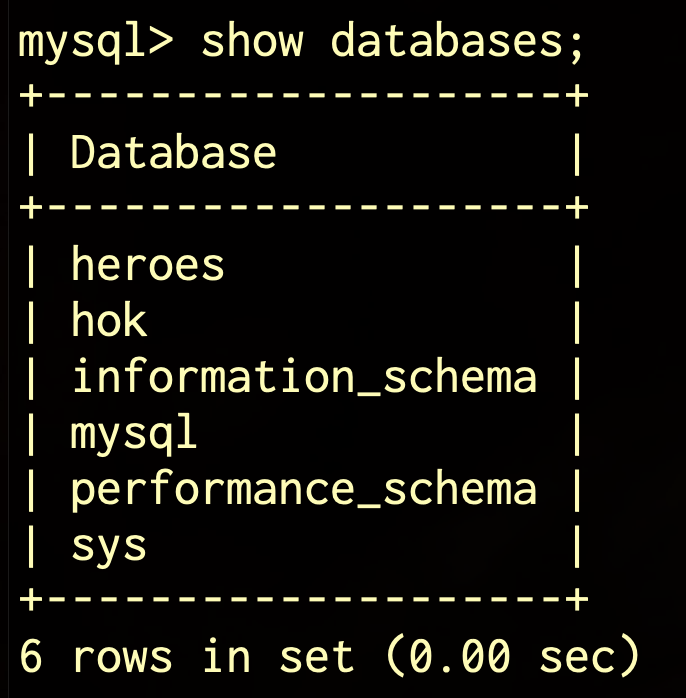
#### MySQL 中的数据库

### 王者荣耀的英雄
- 英雄表
- 英雄表结构
- 英雄表数据

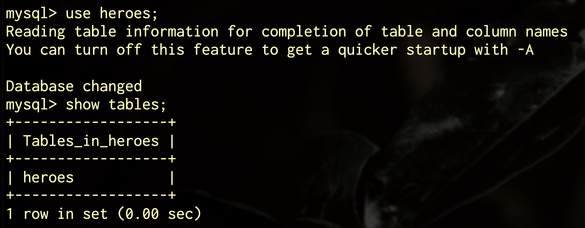
#### 英雄表

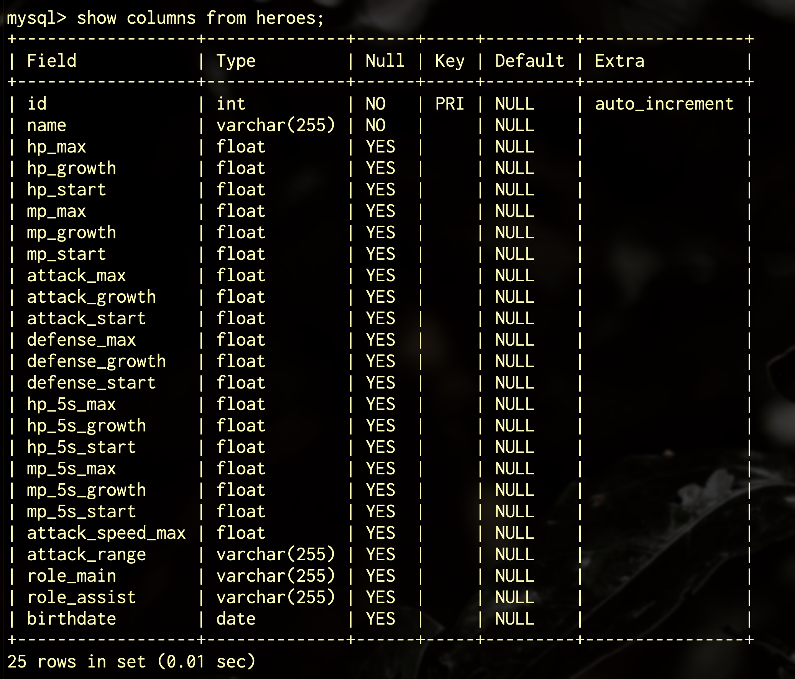
#### 英雄表结构

#### 英雄表数据

### 王者荣耀数据库
- 用户表
- 英雄表
- 用户英雄表
- 对局表
- 对局记录表

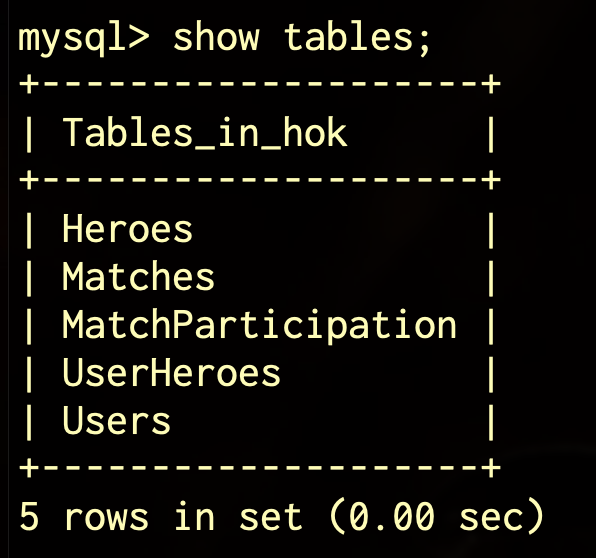
#### 王者荣耀数据库

### 用户表
- 用户表结构
- 用户表数据

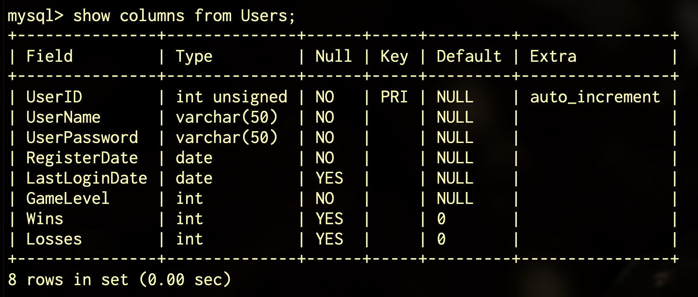
#### 用户表结构

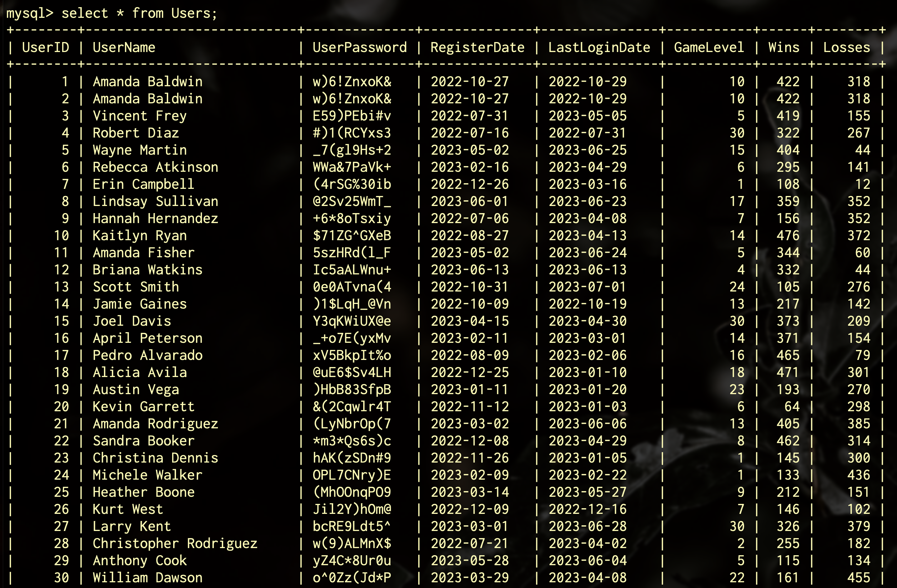
#### 用户表数据

### 英雄表
- 英雄表结构
- 英雄表数据

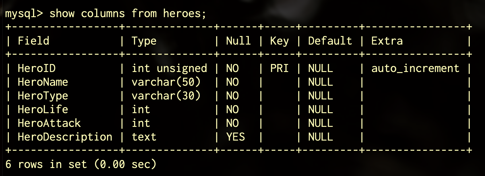
#### 英雄表结构

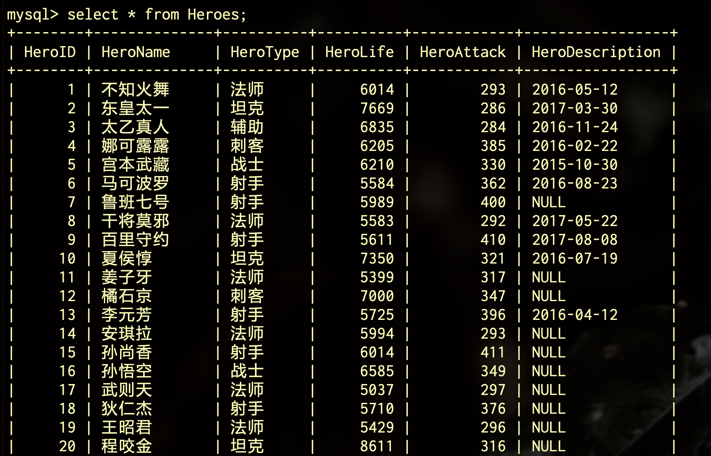
#### 英雄表数据

### 用户英雄表
- 用户英雄表结构
- 用户英雄表数据

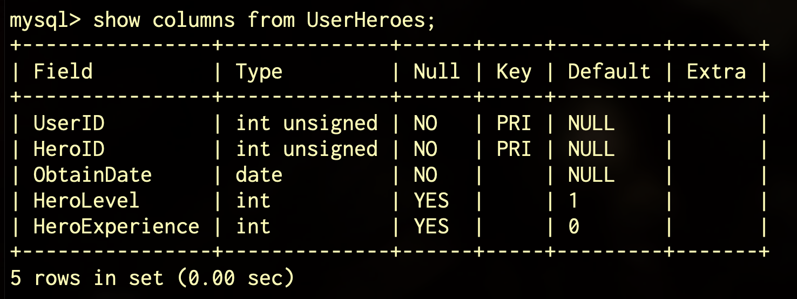
#### 用户英雄表结构

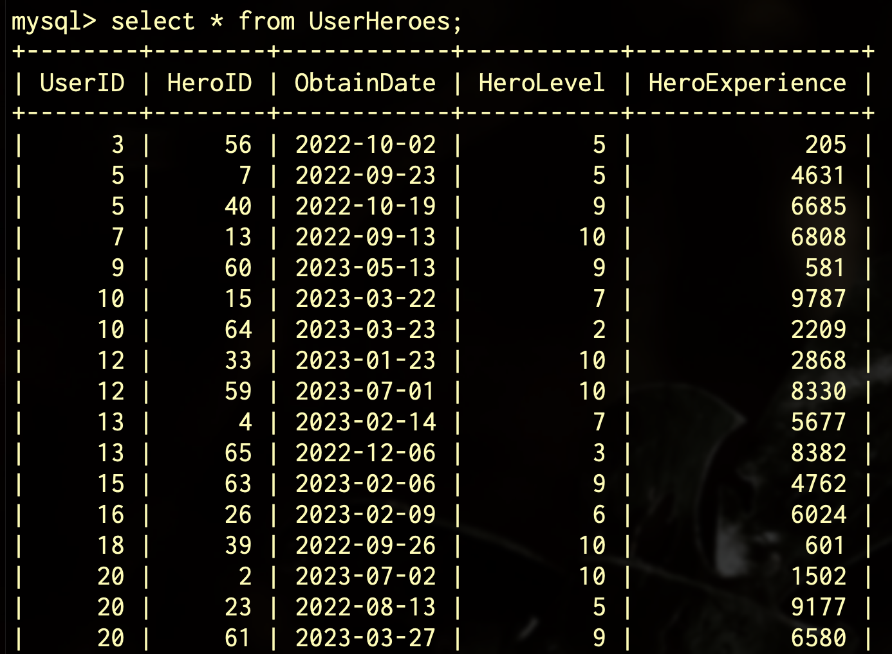
#### 用户英雄表数据

### 对局表
- 对局表结构
- 对局表数据

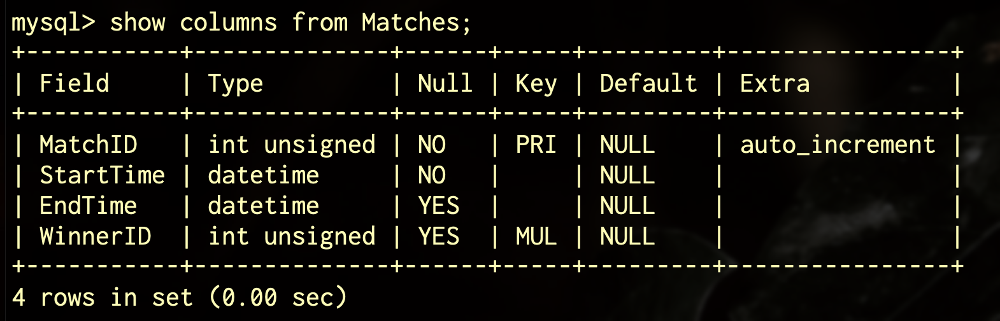
#### 对局表结构

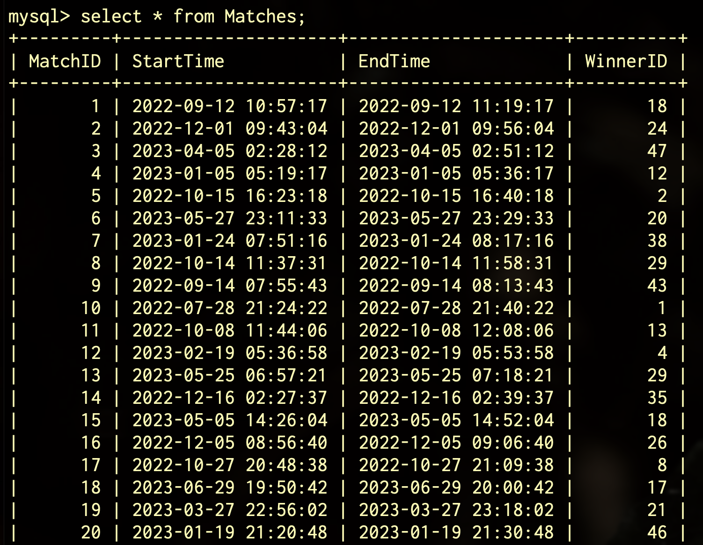
#### 对局表数据

### 对局记录表
- 对局记录表结构
- 对局记录表数据

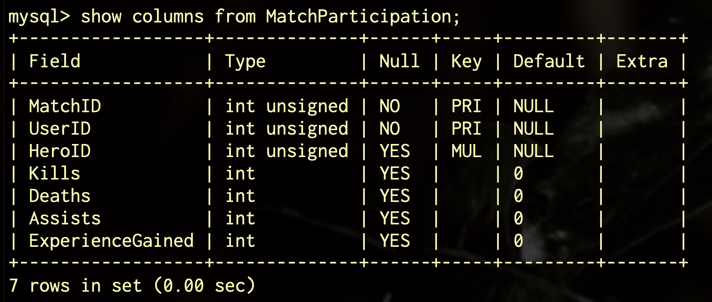
#### 对局记录表结构

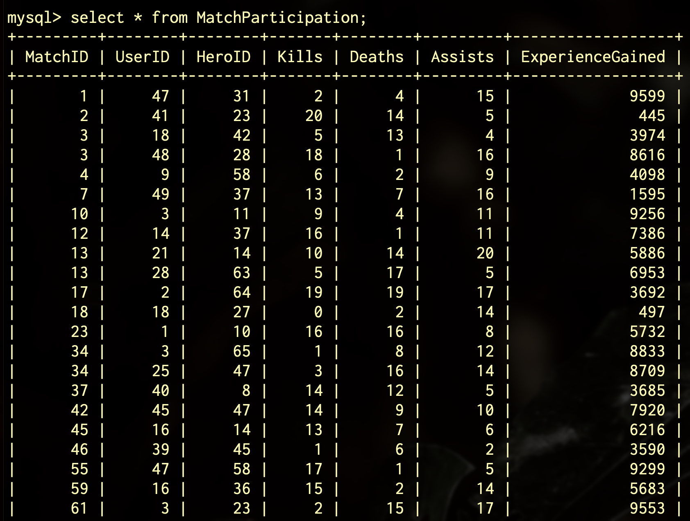
#### 对局记录表数据
