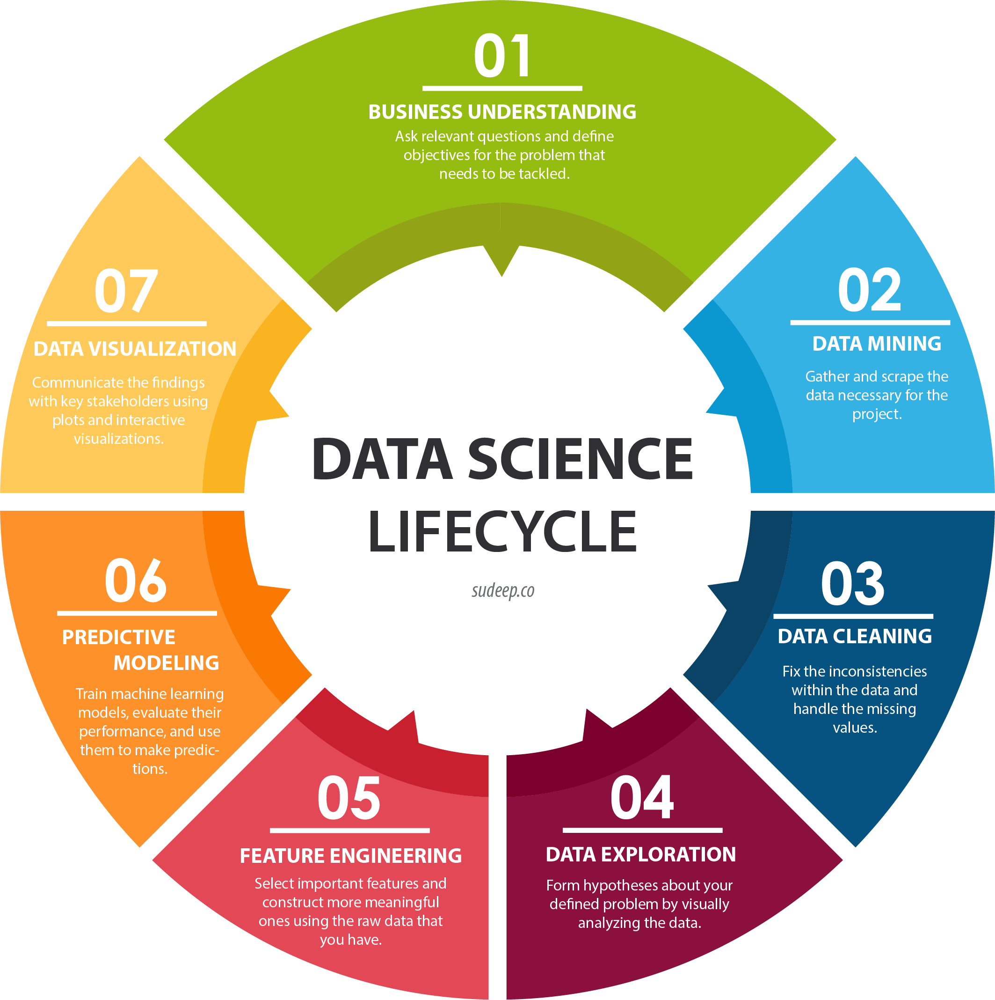
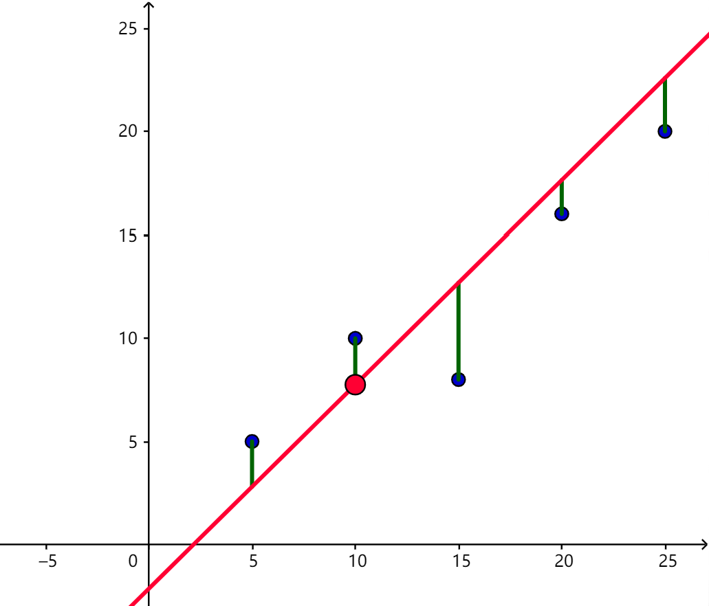
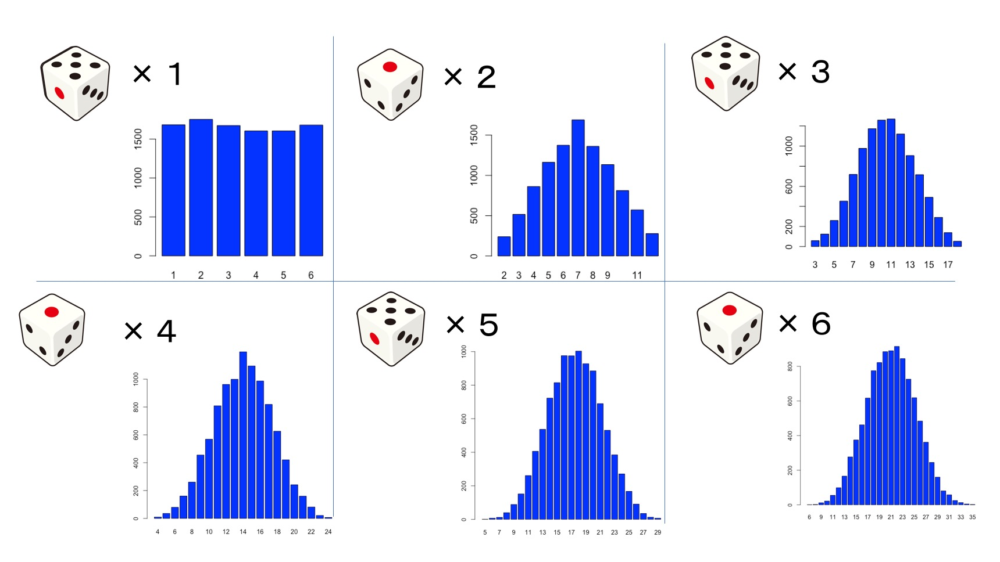

2. 数据科学与人工智能
2.1 数据科学

### 数据科学的历史和发展
- 统计学的起源
- 大数据的崛起
- 数据科学的现代发展

#### Data Science

### 统计学的起源
- 17世纪的概率论
- 18世纪到19世纪
- 20世纪的统计学
- 统计学软件的发展

#### Statistics

### 17世纪的概率论
- 赌博游戏激发概率研究
- 帕斯卡和费马的书信交流
- 讨论赌注的公平分配问题

#### Probability

#### Probability

### 18世纪到19世纪
- 高斯提出正态分布
- 勒让德发展最小二乘法
- 李亚普诺夫提出中心极限定理

### 高斯提出正态分布
- 高斯 (Gauss) 是德国数学家
- 提出正态分布 (Normal Distribution)
- 正态分布公式 $f(x) = \frac{1}{\sqrt{2\pi\sigma^2}}e^{-(x-\mu)^2/(2\sigma^2)}$
- $\mu$表示均值
- $\sigma^2$表示方差
- 正态分布用于描述自然现象

#### Johann Carl Friedrich Gauss, 1777.4.30 - 1855.2.23

#### Normal Distribution

### 勒让德发展最小二乘法
- 勒让德 (Legendre) 是法国数学家
- 发展最小二乘法 (Method of Least Squares)
- 在观测数据有误差时十分有用
- 通过最小化平方差找到符合数据的模型

#### Adrien-Marie Legendre, 1752.9.18 - 1833.1.9

#### Least Squares

### 李亚普诺夫提出中心极限定理
- 李亚普诺夫 (Lyapunov) 是俄国数学家
- 提出中心极限定理 (Central Limit Theorem)
- 适用于大样本
- 独立随机变量平均值的分布近似正态分布
- 为许多统计方法提供了理论基础

#### Aleksandr Mikhailovich Lyapunov, 1857.6.6 - 1918.11.3

#### Central Limit Theorem

### 20世纪的统计学
- 费舍尔提出最大似然估计
- 内曼-皮尔森的决策理论
- 科尔莫哥洛夫的概率测度理论

### 费舍尔提出最大似然估计
- 费舍尔 (R. A. Fisher) 是英国统计学家和生物学家
- 提出最大似然估计法 (Maximum Likelihood Estimation)
- 基于概率模型选择最适合观测数据的参数值
- $\hat{\theta} = argmax_{\theta} L(\theta; x)$
- $L(\theta; x)$ 是给定参数 $\theta$ 下观察到数据 $x$ 的概率
- $\hat{\theta}$ 是使得 $L(\theta; x)$ 最大的 $\theta$ 值

### 内曼-皮尔森的决策理论
- 内曼 (Jerzy Neyman) 和皮尔森 (Egon Pearson) 是统计学家
- 提出了决策理论框架
- 在假设检验和区间估计中都使用这一框架
- 提供了统计推断的逻辑基础

### 科尔莫哥洛夫的概率测度理论
- 科尔莫哥洛夫 (Andrey Kolmogorov) 是苏联数学家
- 提出了概率测度理论 (Measure Theory)
- 把概率定义为集合函数
- 为现代概率论和统计学提供了数学基础

### 统计学软件的发展
- SAS (Statistical Analysis System) 软件
- SPSS (Statistical Package for the Social Sciences) 软件
- R 语言
- Stata 软件

### SAS 软件
- 成立于 1976 年, 位于美国北卡罗来纳州
- SAS 软件最初用于分析农业研究数据
- SAS 提供了全面的商业分析工具
- 数据管理
- 高级分析
- 商业智能
- 客户关系管理

### SPSS 软件
- 成立于 1968 年, 位于美国伊利诺伊州芝加哥
- SPSS 软件最初为社会科学研究设计
- 用于市场研究, 健康研究, 数据挖掘等领域

### R 语言
- 1993 年由罗斯·伊哈卡和罗伯特·詹特曼创建
- 一种开源的统计计算和图形绘制软件
- 强大的数据处理能力
- 高质量的图形绘制
- 大量的统计和机器学习算法包

### Stata 软件
- 用于数据分析和统计
- 用于经济学, 社会科学, 流行病学等领域
- 用于数据管理, 统计分析, 图形绘制等

### 大数据的崛起
- 数据爆炸的原因
- 大数据的特征
- 大数据处理技术
- 大数据在商业和科研中的应用

### 数据爆炸的原因
- 社交媒体产生大量用户数据
- 网络日志记录大量用户行为数据
- 物联网设备产生海量实时数据

### 大数据的特征
- 体量大
- 种类多
- 速度快
- 价值密度低

### 大数据处理技术
- 分布式存储和计算如 Hadoop 和 Spark
- 非关系型数据库如 MongoDB 和 Cassandra
- 数据流处理如 Storm 和 Flink

### Hadoop
- 由 Apache 基金会开发和维护
- 开源软件平台
- 用于分布式存储和处理大规模数据
- Hadoop 分布式文件系统 (HDFS) 
- MapReduce 计算模型

### Spark
- 用于大规模数据处理
- 统一分析引擎
- SQL 查询, 流处理, 机器学习和图处理
- 比 Hadoop MapReduce 更快

### MongoDB
- 面向文档的数据库
- 用于处理大量数据
- 以易于理解和使用的 JSON 格式存储
- 提供高级查询和分析功能

### Cassandra
- 分布式数据库
- 适合处理跨多数据中心和云平台的数据
- 高扩展性和高可用性
- 适用于处理大量快速变化的数据

### Storm
- 开源分布式实时计算系统
- 处理大规模的实时数据流
- 可以与任何编程语言一起使用

### Flink
- 是 Apache 基金会的开源流处理框架
- 提供了数据流处理和批处理的功能
- 支持事件时间处理和状态管理

### 大数据在商业和科研中的应用
- Google 的搜索引擎
- Facebook 的数据分析
- 基因测序数据的存储和分析
- 大型强子对撞机 (LHC) 的数据处理

### 数据科学的现代发展
- 数据科学和统计学的关系
- 数据科学的关键技术
- 数据科学的工具和语言
- 数据科学的挑战和未来

### 数据科学和统计学的相同点
- 都关注数据的收集, 整理, 分析和解释
- 都使用统计模型和方法来分析数据

### 数据科学和统计学的不同点
- 数据科学包括但不限于统计学
- 还包括机器学习, 数据可视化, 数据工程等
- 数据科学更关注大数据和复杂数据的处理
- 统计学则更关注模型的理论性质

### 数据科学的关键技术
- 数据清洗
- 数据可视化
- 数据挖掘
- 预测建模

### 数据清洗
- 识别和处理缺失数据
- 异常值检测
- 数据一致性校验
- 数据转换和规范化

### 数据可视化
- 图表类型
- 数据故事
- 交互式可视化
- 高级可视化

### 数据挖掘
- 关联规则
- 聚类分析
- 异常检测
- 预测

### 预测建模
- 线性回归
- 决策树和随机森林
- 支持向量机
- 神经网络

### 数据科学的工具和语言
- Python
- R
- SQL
- Jupyter Notebook
- Pandas, Numpy, Scipy

### 数据科学的挑战和未来
- 处理高维数据
- 处理不完整和噪声数据
- 确保数据隐私和安全
- 机器学习和人工智能结合

### 数据科学的基本概念和工具
- 数据类型和数据集
- 数据清洗和预处理
- Python 和 R 在数据科学中的应用
- 数据可视化工具

### 数据类型和数据集
- 结构化数据
- 非结构化数据
- 半结构化数据
- 常见数据集

### 数据清洗和预处理
- 插值, 删除, 填充等方法
- 通过 Z-score, IQR 等方法检测和处理
- z-score 标准化, min-max 标准化等
- 独热编码, 标签编码等

### Python和R在数据科学中的应用
- Python 的数据科学库
- R 的数据科学库
- 数据导入和处理
- 数据模型建立和评估

### 数据可视化工具
- Matplotlib
- Seaborn
- ggplot
- 交互式可视化工具

### 数据科学的应用
- 预测建模
- 市场分析
- 医疗健康数据分析
- 社会网络分析

### 预测建模
- 回归模型
- 分类模型
- 时间序列分析

### 市场分析
- 客户细分
- 市场篮分析
- 销售预测

### 医疗健康数据分析
- 疾病预测
- 健康指标分析
- 基因数据分析

### 社会网络分析
- 社区发现
- 关键人物分析
- 社交网络中的信息传播分析

2. 数据科学与人工智能
2.2 机器学习

### 机器学习的历史和发展
- 机器学习的起源和早期发展
- 神经网络的崛起
- 深度学习的发展

### 机器学习的定义
- 通过经验改善性能
- 自动识别模式

### 初期的学习机器
- 感知机
- 适应性线性元素 (Adaline)

### 感知机
- 由Frank Rosenblatt于1957年提出
- 是二分类的线性分类模型
- 输入是实例的特征向量
- 输出是实例的类别
- 可以被看作一个单层神经网络

### 适应性线性元素
- 由 Bernard Widrow 和 Marcian Hoff 于 1960 年提出
- 是感知机的改进版本
- 使用线性激活函数
- 最小化预测值与真实值之间的均方误差

### 初期算法
- 决策树
- 线性回归
- 支持向量机

### 决策树
- 一种基于树结构进行决策的方法
- 通过创建决策规则来预测目标变量
- ID3, C4.5 和 CART 是知名决策树算法

### 线性回归
- 一种预测回归问题的模型
- 试图建立自变量 X 和因变量 Y 之间的线性关系
- 最小化预测值与真实值之间的均方误差

### 支持向量机
- 由 Vladimir N. Vapnik 于 1995 年提出
- 一种二分类模型
- 基于结构风险最小化原则
- 核函数可以将数据映射到高维空间

### 初期应用
- 邮件过滤
- 语音识别
- 计算机视觉

### 神经网络定义
- 模拟人脑神经元网络
- 有大量神经元并行工作

### 模拟人脑神经元网络
- 由多个神经元 (节点) 组成
- 每个神经元处理单个输入并产生输出
- 神经元之间通过连接 (权重) 进行信息传递

### 有大量神经元并行工作
- 神经网络的力量来自并行处理能力
- 可以同时处理大量信息

### 反向传播算法
- 用于训练神经网络
- 计算并优化神经元权重

### 用于训练神经网络
- 是一种监督学习方法
- 根据实际输出和预期输出的误差进行学习

### 计算并优化神经元权重
- 使用梯度下降方法优化权重
- 通过调整权重最小化误差

### 卷积神经网络 (CNN)
- 用于图像和视频处理
- 局部感知和权重共享

### 用于图像和视频处理
- 输入为多维矩阵 (如像素矩阵)
- 通过卷积层提取图像的局部特征

### 局部感知和权重共享
- 每个卷积核都有一组固定的权重
- 这些权重在整个输入图像上共享

### 递归神经网络 (RNN)
- 用于序列数据处理
- 记录历史信息

### 用于序列数据处理
- 对于每个序列元素都有一个输入和一个输出
- 可以处理不同长度的序列

### 记录历史信息
- 使用内部状态保存过去的信息
- 内部状态影响网络的当前和未来决策

### 深度神经网络
- 多层神经网络结构
- 深度学习与神经网络的关系

### 多层神经网络结构
- 拥有多个隐藏层的神经网络
- 可以学习更复杂的特征和模式

### 深度学习与神经网络的关系
- 深度学习是神经网络的一个子集
- 利用深层神经网络结构进行学习

### 卷积神经网络的深化
- AlexNet, VGG, ResNet
- 提升图像处理性能

### AlexNet
- 2012年 Imagenet 比赛冠军
- 8 层网络

### VGG
- 使用重复的网络结构
- 最深达到19层

### ResNet
- 通过残差连接训练超深网络
- 最深达到 152 层

### 提升图像处理性能
- 通过更深的网络学习更复杂的特征
- 在图像识别和目标检测等任务上取得突破

### 自然语言处理的深度学习
- Word2Vec, LSTM, Transformer 模型
- 提升语言理解性能

### Word2Vec
- 训练神经网络
- 学习词的向量表示

### LSTM
- 一种 RNN
- 通过门控机制解决长期依赖问题

### Transformer 模型
- 不需要循环和卷积
- 通过自注意力机制处理序列数据

### 提升语言理解性能
- 通过学习词的语义关系和语句结构
- 在机器翻译和情感分析等任务上取得突破

### 生成模型的发展
- 自编码器 (AutoEncoder)
- 生成对抗网络 (GAN)

### 自编码器 (AutoEncoder)
- 一种神经网络
- 可以学习输入数据的压缩表示
- 主要用于降维和去噪等任务

### 生成对抗网络 (GAN)
- 由两个神经网络 (生成器和判别器) 组成
- 生成器生成假样本
- 判别器尝试区分真假样本

### 机器学习的基本概念和技术
- 监督学习, 无监督学习, 半监督学习和强化学习
- 回归, 分类, 聚类和降维
- 模型评估和验证
- 机器学习库 Scikit-learn, Tensorflow, PyTorch 等

### 机器学习的应用
- 自动驾驶
- 推荐系统
- 金融风险评估
- 图像和声音识别

2. 数据科学与人工智能
2.3 人工智能

### 人工智能的历史和发展
- 早期 AI 理论的提出
- 人工智能的冬天和复苏
- 人工智能的现代发展

### 早期AI理论的提出
- 1956 年达特茅斯会议
- 人工智能成为一个独立的研究领域
- 提出 AI 这个概念
- 认为"任何现在需要人工进行的智能活动都可以由机器做到"

### 人工智能的冬天和复苏
- 70 年代到 90 年代
- 由于技术和经济问题, AI 发展缓慢
- 从 90 年代开始 AI 再次复苏

### 人工智能的现代发展
- 深度学习出现
- 让机器有了更好的学习和理解能力
- 开始广泛应用在各个领域
- 搜索引擎, 语音识别, 自动驾驶等

### 人工智能的基本概念和技术
- 符号主义, 连接主义和行为主义
- 搜索和优化
- 逻辑推理和知识表示
- 人工智能编程语言和工具 LISP, Prolog, Python

### 符号主义, 连接主义和进化主义
- 符号主义认为智能行为可以通过操作符号和规则来实现
- 连接主义认为智能行为来自大量简单计算元素的相互连接, 如神经网络
- 行为主义认为智能行为可以通过模拟生物进化过程来实现, 如遗传算法

### 搜索和优化
- 在问题的解空间中寻找最优解, 如A*搜索, 深度优先搜索等
- 改进或选择最优的解决方案, 如梯度下降, 模拟退火等

### 逻辑推理和知识表示
- 使用形式化的逻辑进行推理, 如谓词逻辑, 模糊逻辑等
- 把知识形式化表示, 以便机器理解, 如本体论, 语义网等

### 人工智能编程语言和工具
- LISP：最早的人工智能编程语言, 强调符号处理
- Prolog：逻辑编程语言, 强调逻辑推理
- Python：现代最流行的人工智能编程语言, 有丰富的库和工具

### 人工智能的应用
- 自动化和机器人技术
- 自然语言处理
- 计算机视觉
- 游戏AI

### 工业自动化
- 工业机器人
- 无人驾驶车辆

### 服务机器人
- 家庭机器人
- 社区服务

### 机器翻译
- 文本翻译
- 实时翻译

### 语音识别
- 语音转文本
- 语音助手

### 图像识别
- 面部识别
- 物体识别

### 视频分析
- 行为识别
- 事件检测

### 游戏策略
- 棋类游戏
- 策略游戏

### 游戏测试
- 游戏质量保证
- 游戏玩家行为模拟

2. 数据科学与人工智能
2.4 自然语言处理

### 机器翻译的起源
- 二战时期的密码解析
- 20世纪50年代的机器翻译研究

### 机器翻译的挑战
- 语言的复杂性和多样性
- 上下文的理解和翻译

### 统计机器翻译
- 基于词典和规则的方法
- 基于大规模语料库的统计翻译

### n元模型
- 一种基于马尔可夫假设的统计语言模型
- 任意词的出现只与前面 n 个词相关
- 这是 "n元" (n-gram) 的含义

### 什么是n元模型
- Bigram：n 为 2, 任何词的出现只与其前面的一个词相关
- Trigram：n 为 3, 任何词的出现只与其前面的两个词相关

### 使用n元模型
- 语音识别
- 拼写检查
- 机器翻译

### 隐马尔科夫模型 (HMM)
- 一种统计模型
- 描述一个隐藏的马尔可夫链随机生成可观察的事件序列的过程

### HMM 原理
- 状态是隐藏的, 不可直接观察到
- 每个状态会产生一个可观察的事件
- 前向后向算法

### 隐马尔科夫模型的应用
- 词性标注
- 序列生成

### 条件随机场 (CRF)
- 一种统计模型
- 预测给定输入序列中每个位置的状态
- CRF 能够考虑未来的输入

### CRF 原理
- CRF 通过特征函数来定义输入和状态之间的关系
- 每个特征函数关联一个权重
- 权重通过训练数据学习得到
- 训练和推断

### 条件随机场的应用
- 命名实体识别
- 信息提取

### 词嵌入模型
- 将单词或短语从词汇表映射到向量
- 可以捕获词义
- 可以获得词与词之间的关系
- Word2Vec
- GloVe

### Word2Vec
### 谷歌开发
- 用于生成词向量的模型
- 计算语义相似性
- 使用浅层神经网络从大量文本数据中学习
- 连续词袋模型 (CBOW)
- 跳字模型 (Skip-gram)

### 连续词袋模型
- 通过上下文单词来预测目标单词
- 对于每个目标单词, 模型查看前后 n 个单词 (上下文)
- 生成这些单词的向量表示
- 然后将其平均化

### 跳字模型
- 通过目标单词来预测上下文
- 对于大规模数据集更有效

### 全局向量 GloVe
- 斯坦福大学开发
- 用于生成词向量
- 不仅仅考虑局部上下文信息
- 还考虑全局统计信息
- 用于词的向量化和计算语义相似性

### GloVe模型的训练
- 构建全局词共现矩阵
- 训练线性回归模型以最小化词向量和共现矩阵之间的方差

### 神经机器翻译
- 序列到序列模型
- 注意力机制的
- Transformer 模型

### 神经机器翻译
- 使用深度学习模型进行机器翻译

### 序列到序列模型
- 包括编码器和解码器
- 编码器接受一个单词序列作为输入, 转换为一种内部表示
- 解码器接受编码器的隐藏状态, 并逐步生成输出序列
- 广泛应用于机器翻译和文本摘要任务

### 注意力机制
- 可以提高序列到序列模型性能
- 允许模型在生成输出时能 "关注" 输入序列中的不同部分
- 静态注意力在每一步都使用相同的注意力权重
- 动态注意力在每一步都会更新注意力权重
- 上下文向量是对输入序列的加权和
- 权重是通过注意力机制计算得到的

### Transformer 模型
- 一种基于注意力机制的模型
- 不需要循环结构
- 可以并行处理序列中的所有位置
- 在机器翻译和语言理解等任务上有所突破

### 自注意力
- 一种特殊的注意力机制
- 其输入和输出都来自同一序列

### 多头注意力
- 对自注意力的一种改进
- 可以同时关注序列中的多个位置

### 位置编码
- Transformer 模型需要添加位置编码来提供位置信息

### NLP 的基本概念和技术
- 词性标注
- 实体识别
- 句法分析
- 依存关系分析
- 词义消歧
- 语义角色标注

### 词性标注
- 将词汇分配给一组预定义的词性
- 通常使用基于序列的模型
- 帮助理解句子的结构和含义

### 实体识别
- 识别文本中的具名实体
- 使用基于序列的模型
- 使用 BIO 标记系统
- 是关系抽取和知识图谱构建的重要步骤
- 帮助提取出文本中的关键信息

### 句法分析
- 句法分析是确定句子结构的任务
- 成分句法分析关注句子的层次结构
- 而依存句法分析关注词与词之间的关系
- 在机器翻译和语义理解等任务中起关键作用

### 依存关系分析
- 确定句子中词与词之间的依存关系
- 根据依存句法规则和解析算法
- 在信息提取和句子生成任务中起关键作用

### 词义消歧
- 确定多义词在特定上下文中的正确含义
- 采用基于上下文的方法
- 基于知识库的方法
- 在机器翻译和问答系统等任务中起关键作用

### 语义角色标注
- 确定句子中词的语义角色
- 首先定义一组语义角色
- 然后使用标注模型来标注
- 在信息提取和事件检测等任务中起关键作用

### 信息提取
- 从非结构化文本中抽取出结构化信息
- 关系提取
- 事件提取

### 关系提取
- 识别和分类文本中实体间的语义关系
- 规则方法
- 统计方法
- 在知识图谱构建和智能问答系统中起关键作用

### 事件提取
- 识别和分类文本中的事件及参与者和相关属性
- 触发词识别
- 论元识别
- 在新闻摘要和事件预警系统中有广泛应用

### 文本挖掘
- 从大量文本数据中抽取有价值信息
- 文本分类
- 文本聚类

### 文本分类
- 将文本分配到一组预定义的类别
- 朴素贝叶斯
- 支持向量机
- 神经网络
- 在情感分析和主题标注等任务中有广泛应用

### 文本聚类
- 将文本按相似度自动分组
- K-均值
- 层次聚类
- 和主题模型
- 在文档分类和主题发现等任务中有广泛应用

### 机器翻译
- 将一种语言的文本自动翻译成另一种语言
- 统计机器翻译
- 神经机器翻译

### 语音识别
- 将语音信号转化为文本
- 语音转文本
- 语音命令识别

### 统计机器翻译
- 基于大量双语文本数据学习翻译模型
- 统计分析源语言和目标语言之间的对应关系
- ### 神经机器翻译
- 使用神经网络模型翻译
- 可以更好地捕获语言的复杂模式和依赖性

### 语音转文本
- 将语音信号转化为文本
- 通过模型学习声音和语言之间的映射
- ### 语音命令识别
- 识别并执行语音命令
- 常用于语音助手和智能家居

### 自然语言处理库
- 提供了预构建的功能和工具
- NLTK
- Stanford NLP
- Gensim

### NLTK库
- Natural Language Toolkit
- 用Python编写
- 包含了大量的语言处理函数
- 还提供了大量的语料库和资源
- 分词
- 词性标注
- 句法解析

### Stanford NLP库
- 以Java编写的
- 提供了Python接口
- 实体识别
- 句法解析
- 依存解析
- 情感分析

### Gensim库
- 用Python编写
- 适用于处理大型文本数据
- 主题建模
- 文档相似性分析
- 文本向量化
- 主题建模
- 词向量训练

### 自然语言处理的应用
- 基于关键词的搜索
- 基于语义的搜索
- 网页排名算法
- 个性化搜索和推荐

### 基于关键词的搜索
- 基于词汇匹配
- 根据查询和文档中的关键词匹配度

### 基于语义的搜索
- 基于语义理解
- 根据查询和文档中的语义相关度

### 网页排名算法
- 评估网页重要性的技术
- 常用的算法有 PageRank 等
- 根据网页的链接结构和用户行为数据

### 个性化搜索和推荐
- 基于用户兴趣和行为的搜索和推荐技术
- 可以提供更符合用户需求的搜索结果和推荐内容

### 情感分析
- 理解和解析人类语言中表达的主观信息
- 文本情感分析
- 社交媒体情感分析

### 文本情感分析
- 从文本中提取作者的情感或情绪
- 基于词典的方法
- 基于机器学习的方法

### 社交媒体情感分析
- 对社交媒体内容进行情感分析
- 情感倾向分析
- 情绪识别

### 基于词典的方法
- 依赖于预先构建的情感词典
- 词典中的每个词都带有情感极性标签
- 将文本分解为单词或短语
- 使用词典来确定这些单词或短语的情感倾向
-
### 基于机器学习的方法
- 将情感分析任务视为一个分类问题
- 训练机器学习模型来预测文本的情感倾向

### 情感倾向分析
- 识别社交媒体内容情感倾向
- 积极, 消极或中立

### 情绪识别
- 识别社交媒体内容表达的具体情绪
- 快乐, 悲伤, 恐惧, 愤怒等

### 自动文摘
- 从一个或多个文档中提取关键信息
- 生成包含主要内容的短文本
- 提取式文摘
- 抽象式文摘

### 提取式文摘
- 从原文中提取关键句子或短语来构建摘要
- 生成的摘要通常较为准确
- 可能缺乏连贯性。

### 抽象式文摘
- 理解原文的主要内容
- 以新的方式表达
- 可以生成更自然和连贯的摘要
- 实现难度较大

### 文本生成
- 根据一定的输入生成人类可读文本的任务
- 自动写作
- 自动回复

### 自动写作
- 让机器自动产生文章或故事
- 应用于新闻报导, 故事生成和自动编程

### 自动回复
- 根据用户的问题或请求自动生成回复
- 应用于聊天机器人, 邮件回复和智能客服

### 语音助手
- 通过语音交互
- 帮助用户完成各种任务的智能设备或软件
- Siri, Alexa等
- 语音识别和自然语言理解

### 聊天机器人
- 通过文字或语音与人进行交互的软件
- 客服机器人
- 社交机器人

2. 数据科学与人工智能
2.5 人工智能展望

# 人工智能的伦理, 法律和社会影响
## 弱AI与强AI的讨论
### 弱AI的定义与例子
- 专注于具体任务的AI
- 如：语音识别, 图像识别
### 强AI的定义与例子
- 理论上具备全部人类认知能力的AI
- 如：AGI (人工普通智能)
### 弱AI与强AI的差异
- 知识广度
- 自我意识
- 决策复杂度

## 人工智能的未来趋势
### 从监督学习到无监督学习
- 数据标注的挑战
- GANs的成功案例
### 自动化机器学习 (AutoML)
- 降低机器学习的门槛
- Neural Architecture Search的例子
### 可解释的AI
- AI决策的透明度问题
- LIME和SHAP的介绍

## 人工智能的未来趋势
### 从监督学习到无监督学习
### 数据标注的挑战
- 需要大量人工劳动
- 标注质量不一
- 标注成本高
### GANs的成功案例
- 生成对抗网络的原理
- GAN在图像生成, 图像超分辨率等领域的应用

### 自动化机器学习 (AutoML)
### 降低机器学习的门槛
- 无需深度专业知识
- 加速模型开发和部署
### Neural Architecture Search的例子
- NAS的工作原理
- Google的AutoML和NASNet的介绍

### 可解释的AI
### AI决策的透明度问题
- 解释模型的重要性
- 模型解释性的挑战
### LIME和SHAP的介绍
- LIME (局部可解释的模型-基本解释) 的原理
- SHAP (SHapley Additive exPlanations) 的原理

降低机器学习的门槛
自动化机器学习 (AutoML) 的目标是使不具有深度专业知识的用户也能使用机器学习技术。AutoML可以自动完成数据预处理, 特征选择, 模型选择, 调参等步骤, 大大降低了用户使用机器学习的难度。这样, 用户可以将更多的精力放在解决实际问题上, 而不是调试机器学习模型。同时, AutoML可以自动化试验和迭代过程, 加速模型开发和部署的速度。

Neural Architecture Search的例子
神经架构搜索 (Neural Architecture Search, NAS) 是一种自动化机器学习的方法, 它自动在预定义的搜索空间中搜索最优的神经网络结构。Google的AutoML就是使用NAS找出了一个优秀的卷积神经网络结构, 被称为NASNet。AutoML和NASNet的研究显示, 机器找到的神经网络结构可以超过人类专家手动设计的结构。

可解释的AI
可解释的AI关注的是如何使机器学习模型的预测结果更透明和可理解。随着机器学习模型 (特别是深度学习模型) 变得越来越复杂, 它们的决策过程也越来越难以理解, 这就造成了模型的"黑箱"问题。然而, 在很多领域, 如医疗, 金融等, 我们需要理解模型是如何做出预测的, 这样才能信任模型的结果。因此, 如何提高模型的解释性, 使得非专家用户也能理解模型的决策过程, 成为了一个重要的研究方向。

LIME和SHAP的介绍
LIME (Local Interpretable Model-agnostic Explanations) 和SHAP (SHapley Additive exPlanations) 是解释模型预测的两种主要方法。LIME的基本思想是在预测结果附近生成一个可解释的简单模型 (如线性模型) , 以此来解释模型的预测。而SHAP是一种基于博弈论的解释方法, 它为每个特征分配一个重要性分数, 表示这个特征对预测结果的贡献。这两种方法都可以提供直观的可视化, 帮助用户理解模型的预测。

## 边缘AI和分布式AI
### 边缘AI的概念与优势
### 在设备上进行AI计算
- 减少网络延迟
- 实时决策
### 实时性, 隐私保护
- 数据局部化处理
- 减少数据传输和存储
### 分布式AI的概念与优势
### 利用多台机器并行处理
- 分布式训练的原理
- 分布式训练框架 (如TensorFlow的分布式版本)
### 处理大数据, 提高计算速度
- 加快模型训练速度
- 提高模型精度

## 人工智能和其他科技的交叉融合：量子计算, 生物科技等
### 人工智能与量子计算的交叉融合
### 量子机器学习的介绍
- 量子计算的基本原理
- 量子机器学习的潜力和挑战
### Google和IBM的研究进展
- Google的量子霸权
- IBM的量子计算机和云平台
### 人工智能与生物科技的交叉融合
### AI在基因编辑和蛋白质折叠上的应用
- AI在基因测序数据分析的应用
- AI在药物发现的应用
### AlphaFold的介绍
- AlphaFold解决蛋白质折叠问题的原理
- AlphaFold的影响和意义

## 人工智能在各行各业的未来应用展望
### AI在医疗健康领域的应用
### AI辅助诊断, 个性化医疗
- AI在医疗影像诊断的应用
- AI在疾病预测和治疗方案推荐的应用
### DeepMind在眼科和肾病上的研究
- DeepMind在眼科疾病检测的应用
- DeepMind在预测肾脏疾病的研究
### AI在教育领域的应用
### 个性化学习, 智能辅导
- AI在学习路径推荐的应用
- AI在自动批改和智能回答问题的应用
### Khan Academy的实践
- Khan Academy的在线教育模式
- Khan Academy的个性化学习系统
## 边缘AI和分布式AI
### 边缘AI的概念与优势
- 在设备上进行AI计算
- 实时性, 隐私保护
### 分布式AI的概念与优势
- 利用多台机器并行处理
- 处理大数据, 提高计算速度

## 人工智能和其他科技的交叉融合：量子计算, 生物科技等
### 人工智能与量子计算的交叉融合
- 量子机器学习的介绍
- Google和IBM的研究进展
### 人工智能与生物科技的交叉融合
- AI在基因编辑和蛋白质折叠上的应用
- AlphaFold的介绍

## 人工智能在各行各业的未来应用展望
### AI在医疗健康领域的应用
- AI辅助诊断, 个性化医疗
- DeepMind在眼科和肾病上的研究
### AI在教育领域的应用
- 个性化学习, 智能辅导
- Khan Academy的实践
当然, 让我们详细解释这些部分：

### 量子机器学习的介绍
### 量子计算的基本原理
量子计算是一种新型的计算模型, 它使用量子位 (qubit) 进行计算, 而不是经典计算中的位。一个量子位可以同时处于0和1的状态, 这种性质被称为量子叠加。此外, 量子位还可以相互纠缠, 这意味着一个量子位的状态可以立即影响另一个量子位的状态, 即使它们相隔很远。这些量子特性使得量子计算机能同时处理大量数据, 理论上比经典计算机更强大。

### 量子机器学习的潜力和挑战
量子机器学习 (Quantum Machine Learning, QML) 试图利用量子计算的优势来提升机器学习的性能。一些初步的研究显示, QML可能在某些任务上超越经典的机器学习算法。然而, QML也面临着很多挑战, 如量子计算机的物理实现难度大, 误差率高, 以及缺乏高效的量子机器学习算法等。

### Google和IBM的研究进展
### Google的量子霸权
在2019年, Google宣布实现了"量子霸权", 即他们的量子计算机在特定任务上超越了世界上最强的经典超级计算机。这是一个重要的里程碑, 表明量子计算有实现其理论潜力的可能。

### IBM的量子计算机和云平台
IBM也是量子计算的重要推动者, 他们不仅在量子硬件的研发上取得了进展, 而且建立了IBM Quantum Experience, 这是一个云平台, 任何人都可以在上面使用IBM的量子计算机, 进行实验和学习。

### 人工智能与生物科技的交叉融合
### AI在基因编辑和蛋白质折叠上的应用
### AI在基因测序数据分析的应用
随着基因测序技术的发展, 我们现在可以快速, 低成本地获取大量的基因测序数据。然而, 如何从这些数据中提取有用的信息, 如发现疾病相关的基因, 是一个复杂的问题。AI, 特别是深度学习, 已经在这方面显示出了强大的能力。

### AI在药物发现的应用
AI也正在改变药物发现的过程。传统的药物发现需要大量的实验和时间, 而AI可以通过预测分子的性质和生物活性, 大大加速这个过程。比如, AI可以帮助我们找出可能对特定疾病有效的药物, 或者预测出新的药物分子。

### AlphaFold的介绍
### AlphaFold解决蛋白质折叠问题的原理
AlphaFold是由DeepMind开发的一个AI系统, 它可以预测蛋白质的三维结构。AlphaFold使用深度学习模型从蛋白质的氨基酸序列预测出蛋白质的三维结构。这个问题被称为蛋白质折叠问题, 是生物学中的一个长期未解问题。

### AlphaFold的影响和意义
AlphaFold的出现是生物学和人工智能领域的一大突破。准确的蛋白质结构预测对于理解生命过程和开发新药非常重要。AlphaFold的成功预示着AI在解决复杂科学问题上的潜力。

